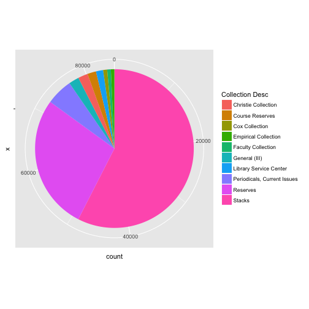

## Initialization

Data

```r
loans_tbl <- tbl_df(read_tsv("Loans.csv"))
```

```
## Warning: 643 parsing failures.
##  row     col   expected actual
## 1362 Copy ID an integer    c.1
## 1364 Copy ID an integer    c.1
## 1365 Copy ID an integer    c.1
## 1366 Copy ID an integer    c.1
## 1367 Copy ID an integer    c.1
## .... ....... .......... ......
## .See problems(...) for more details.
```

--- .class #id 

## How many rows?

```r
nrow(loans_tbl)
```

```
## [1] 88781
```

--- .class #id

## How many loans?

|       Collection Desc       |  count  |
|:---------------------------:|:-------:|
|           Stacks            |  48839  |
|          Reserves           |  23334  |
| Periodicals, Current Issues |  4590   |
|        General (III)        |  1774   |
|     Christie Collection     |  1695   |
|       Course Reserves       |  1496   |
|   Library Service Center    |  1237   |
|       Cox Collection        |   699   |
|     Faculty Collection      |   634   |
|    Empirical Collection     |   606   |

---

## Charts!


